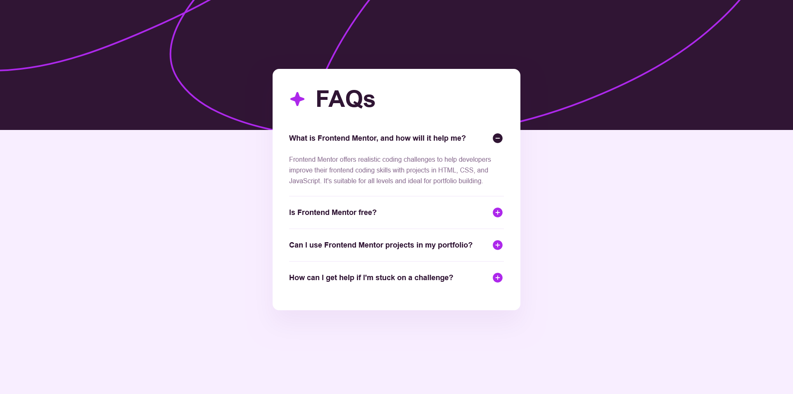

# Frontend Mentor - FAQ accordion solution

This is a solution to the [FAQ accordion challenge on Frontend Mentor](https://www.frontendmentor.io/challenges/faq-accordion-wyfFdeBwBz).  

## Table of contents

- [Overview](#overview)
  - [The challenge](#the-challenge)
  - [Screenshot](#screenshot)
  - [Links](#links)
- [My process](#my-process)
  - [Built with](#built-with)
  - [What I learned](#what-i-learned)
  - [Continued development](#continued-development)
- [Author](#author)

## Overview

### The challenge

Users should be able to:

- Hide/Show the answer to a question when the question is clicked
- Navigate the questions and hide/show answers using keyboard navigation alone
- View the optimal layout for the interface depending on their device's screen size
- See hover and focus states for all interactive elements on the page

### Screenshot



### Links

- Solution URL: [https://github.com/henrydevlab/faq-accordion](https://github.com/henrydevlab/faq-accordion)
- Live Site URL: [https://henrydevlab.github.io/faq-accordion/](https://henrydevlab.github.io/faq-accordion/)

## My process

### Built with

- Semantic HTML5 markup
- CSS custom properties
- Flexbox
- CSS Grid
- Mobile-first workflow
- Smooth custom `@keyframes` entry transitions

### What I learned

During this project, I deepened my knowledge of native HTML accordion interactions and structural layouts.

1. **Native Exclusive Accordions:** I learned that by using the modern HTML `name` attribute on multiple `<details>` elements, the browser handles exclusive collapse mechanics automatically—closing previously open items whenever a new one is triggered without requiring JavaScript.

```html
<details class="faq-accordion__item" name="faq-group" open>
  <summary class="faq-accordion__trigger">
    <span class="faq-accordion__question">What is Frontend Mentor, and how will it help me?</span>
  </summary>
</details>
```
2. **Pure CSS State Icons:** Instead of rendering secondary elements or heavy scripts, I learned how to bind structural asset switches directly to native state flags like [open] using advanced attribute selectors and single-line scoping.

```css
/* Swaps active icon assets smoothly based on the open state flag */
.faq-accordion__item[open] .faq-accordion__icon--plus { opacity: 0; transform: rotate(90deg); }
.faq-accordion__item[open] .faq-accordion__icon--minus { opacity: 1; transform: rotate(0deg); }
```

### Continued development

In future front-end build pipelines, I intend to focus heavily on:

- Extending strict accessibility architectures (such as fine-tuning keyboard focus outlines and custom aria-label declarations).
- Managing multi-layer background patterns efficiently across varying viewport dimensions using fluid system variables.

**Note: Delete this note and the content within this section and replace with your own plans for continued development.**

## Author

- Frontend Mentor - [@henrydevlab](https://www.frontendmentor.io/profile/henrydevlab)
- Twitter - [@henrydevlab](https://www.twitter.com/henrydevlab)
